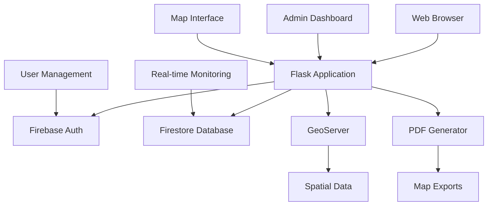

# Divyadrishti - Advanced Drone Mapping & GIS Platform

<div align="center">


**A comprehensive web-based GIS mapping platform for the Uttarakhand Space Application Center**

[](https://python.org)
[](https://flask.palletsprojects.com)
[](https://firebase.google.com)
[](https://leafletjs.com)
[](LICENSE)

</div>

## 🌟 Overview

Divyadrishti is a state-of-the-art web-based Geographic Information System (GIS) platform designed for the Drone Application & Research Center at Uttarakhand Space Application Center. It provides comprehensive mapping capabilities, real-time data visualization, and advanced geospatial analysis tools for drone-based research and applications.

### 🎯 Key Capabilities

- **🗺️ Interactive Mapping**: Advanced Leaflet-based interface with multiple base layers
- **🔐 Enterprise Authentication**: Firebase-powered user management with role-based access
- **📊 Real-time Dashboard**: Comprehensive admin panel with system monitoring
- **📄 Professional PDF Export**: High-quality map exports with metadata and styling
- **🌐 GeoServer Integration**: Seamless integration with enterprise GIS infrastructure
- **📱 Responsive Design**: Mobile-first design for field operations
- **🔔 Smart Notifications**: Automated system monitoring and alerting
- **🎨 Modern UI/UX**: Dark/light themes with accessibility features

## 🏗️ Architecture

### Technology Stack

**Backend**
- **Flask 2.3+**: Modern Python web framework
- **Firebase Admin SDK**: Authentication and real-time database
- **GeoServer Integration**: Enterprise geospatial data management
- **ReportLab**: Professional PDF generation
- **psutil**: System monitoring and analytics

**Frontend**
- **Leaflet.js**: Interactive mapping library
- **Vanilla JavaScript**: Modern ES6+ with modular architecture
- **CSS Grid/Flexbox**: Responsive layout system
- **Firebase SDK**: Real-time client updates

**Infrastructure**
- **Firestore**: NoSQL document database
- **GeoServer**: Geospatial data server
- **OpenStreetMap**: Base mapping services
- **Google Maps**: Satellite imagery

### System Architecture



## 🚀 Quick Start

### Prerequisites

- Python 3.11 or higher
- Node.js 16+ (for development tools)
- GeoServer instance
- Firebase project

### Installation

1. **Clone the repository**
   ```bash
   git clone https://github.com/your-org/divyadrishti.git
   cd divyadrishti
   ```

2. **Set up Python environment**
   ```bash
   python -m venv venv
   source venv/bin/activate  # On Windows: venv\Scripts\activate
   pip install -r requirements.txt
   ```

3. **Configure Firebase**
   ```bash
   # Copy your Firebase service account key
   cp path/to/your/firebase-service-account.json .
   
   # Set environment variables
   export FIREBASE_PROJECT_ID="your-project-id"
   export SECRET_KEY="your-secret-key"
   ```

4. **Configure GeoServer**
   ```bash
   # Update GeoServer settings in static/js/map.js
   export GEOSERVER_USERNAME="admin"
   export GEOSERVER_PASSWORD="geoserver"
   ```

5. **Run the application**
   ```bash
   python app.py
   ```

6. **Access the platform**
   - Open http://localhost:5000
   - Default admin: `admin` / `admin123`

## 📋 Features

### 🗺️ Advanced Mapping

- **Multi-layer Support**: Raster and vector layers from GeoServer
- **Base Layer Options**: OSM, Google Satellite, Hybrid, Terrain
- **Interactive Controls**: Zoom, pan, layer toggle, opacity control
- **Feature Information**: Click-to-query vector layer attributes
- **Smart Layer Loading**: Optimized loading for different layer types
- **Legend Management**: Dynamic legend generation with styling

### 👥 User Management

- **Role-based Access**: Admin, Analyst, User roles
- **Registration Workflow**: Admin approval process
- **Profile Management**: User settings and preferences
- **Activity Tracking**: Comprehensive audit logging
- **Session Management**: Secure authentication with Firebase

### 📊 Admin Dashboard

- **System Monitoring**: Real-time resource usage tracking
- **User Analytics**: Login patterns and usage statistics
- **Storage Management**: Disk space and database monitoring
- **Alert System**: Automated notifications for system events
- **Project Management**: Track mapping projects and progress

### 📄 Professional PDF Export

- **High-Quality Maps**: Composite images with base layers and overlays
- **Rich Metadata**: Location, coordinates, timestamp, scale information
- **Visual Styling**: Color-coded layer representation
- **Custom Layouts**: Professional A4 format with branding
- **Batch Processing**: Multiple export formats and options

### 🔔 Smart Monitoring

- **System Health**: CPU, memory, disk, network monitoring
- **API Monitoring**: Response time and availability tracking
- **Browser Resources**: Client-side performance monitoring
- **Automated Alerts**: Configurable thresholds and notifications
- **Real-time Updates**: Live dashboard updates via Firestore

## 🛠️ Configuration

### Environment Variables

```bash
# Flask Configuration
SECRET_KEY=your-secret-key-here
DEBUG=False

# Firebase Configuration
FIREBASE_PROJECT_ID=your-firebase-project-id
FIREBASE_SERVICE_ACCOUNT_PATH=firebase-service-account.json

# GeoServer Configuration
GEOSERVER_USERNAME=admin
GEOSERVER_PASSWORD=geoserver
```

### GeoServer Setup

1. **Configure Workspaces**: Set up your data workspaces in GeoServer
2. **Layer Styling**: Create SLD styles for proper color representation
3. **Security**: Configure authentication and access controls
4. **Performance**: Optimize tile caching and rendering

### Firebase Setup

1. **Create Project**: Set up Firebase project with Authentication and Firestore
2. **Security Rules**: Configure Firestore security rules (see `FIREBASE_SETUP.md`)
3. **Service Account**: Generate and configure service account credentials
4. **Client Config**: Update `static/js/firebase-config.js` with your project settings

## 📚 Documentation

- **[Codebase Index](CODEBASE_INDEX.md)**: Comprehensive code structure overview
- **[Firebase Setup](FIREBASE_SETUP.md)**: Detailed Firebase integration guide
- **[Notification System](AUTO_NOTIFICATION_PARAMETERS.md)**: Monitoring configuration
- **[API Documentation](docs/API.md)**: REST API reference
- **[Deployment Guide](docs/DEPLOYMENT.md)**: Production deployment instructions

## 🔧 Development

### Project Structure

```
divyadrishti/
├── app.py                 # Main Flask application
├── firebase_config.py     # Firebase integration
├── templates/             # Jinja2 templates
├── static/               # CSS, JS, images
├── docs/                 # Documentation
└── tests/                # Test suite
```

### Development Workflow

1. **Feature Development**: Create feature branches from `main`
2. **Testing**: Run test suite with `pytest`
3. **Code Quality**: Use `black`, `flake8`, `mypy` for code quality
4. **Documentation**: Update relevant documentation
5. **Pull Request**: Submit PR with comprehensive description

### API Development

- **RESTful Design**: Follow REST principles for new endpoints
- **Authentication**: Use `@login_required` and `@admin_required` decorators
- **Error Handling**: Implement proper error responses and logging
- **Documentation**: Update API documentation for new endpoints

## 🚀 Deployment

### Production Checklist

- [ ] **Security**: Change default credentials and secrets
- [ ] **HTTPS**: Configure SSL/TLS certificates
- [ ] **Database**: Set up production Firestore with security rules
- [ ] **Monitoring**: Configure logging and monitoring
- [ ] **Backup**: Implement backup strategies
- [ ] **Performance**: Optimize static assets and caching

### Docker Deployment

```dockerfile
FROM python:3.11-slim
WORKDIR /app
COPY requirements.txt .
RUN pip install -r requirements.txt
COPY . .
EXPOSE 5000
CMD ["gunicorn", "--bind", "0.0.0.0:5000", "app:app"]
```

## 🤝 Contributing

We welcome contributions! Please see our [Contributing Guidelines](CONTRIBUTING.md) for details.

### Development Setup

1. Fork the repository
2. Create a feature branch
3. Make your changes
4. Add tests for new functionality
5. Submit a pull request

## 📄 License

This project is licensed under the MIT License - see the [LICENSE](LICENSE) file for details.

## 🆘 Support

- **Documentation**: Check our comprehensive docs
- **Issues**: Report bugs via GitHub Issues
- **Discussions**: Join our GitHub Discussions
- **Email**: Contact the development team

## 🙏 Acknowledgments

- **Uttarakhand Space Application Center**: Project sponsorship and requirements
- **Open Source Community**: Libraries and tools that make this possible
- **Contributors**: All developers who have contributed to this project

## 🔍 Detailed Features

### Map Interface Features

- **Base Layer Management**: Switch between OpenStreetMap, Google Satellite, Hybrid, and Terrain
- **Layer Opacity Control**: Individual opacity sliders for each active layer (0-100%)
- **Smart Auto-Zoom**: Raster layers auto-fit to bounds, vector layers maintain current view
- **Feature Interaction**: Click on vector features to view detailed attribute information
- **Location Search**: Integrated Nominatim geocoding for location-based navigation
- **Legend Display**: Dynamic legend generation with real-time opacity controls
- **Multi-language Support**: English and Hindi interface translations

### PDF Export Capabilities

- **Composite Map Images**: Combines base layers with GeoServer overlays
- **Rich Metadata**: Includes coordinates, address, timestamp, and scale information
- **Visual Layer Table**: Shows layer name, type, opacity, and actual style colors
- **Color Extraction**: Automatically detects colors from GeoServer SLD styles
- **Professional Layout**: A4 format with proper headers and institutional branding
- **Error Handling**: Graceful fallbacks for image generation failures

### Admin Dashboard Features

- **User Management**: Create, update, delete users with role assignments
- **Pending Approvals**: Review and approve/reject user registration requests
- **System Monitoring**: Real-time CPU, memory, disk, and network usage
- **Storage Analytics**: Track GeoServer data usage and storage quotas
- **Activity Logs**: Comprehensive audit trail of user actions
- **Alert Management**: Configure and monitor system alerts and notifications

### Real-time Monitoring System

- **Performance Thresholds**: Configurable CPU (75%), Memory (80%), Disk (85%) alerts
- **Health Checks**: Database connectivity, API availability, storage access monitoring
- **Browser Monitoring**: Client-side memory usage and storage quota tracking
- **Scheduled Events**: Daily backups, security scans, system updates
- **Network Quality**: Connection type and bandwidth monitoring
- **Battery Awareness**: Low battery alerts for mobile devices

## 🔧 Advanced Configuration

### GeoServer Integration

```javascript
// Configure GeoServer endpoints in static/js/map.js
const GEOSERVER_WMS_BASE_URL = "http://your-geoserver:8080/geoserver/";
const GEOSERVER_WFS_BASE_URL = "http://your-geoserver:8080/geoserver/";
```

### Notification Thresholds

```javascript
// Customize alert thresholds in notification-triggers.js
this.thresholds = {
    cpu: 75,        // CPU warning threshold (%)
    memory: 80,     // Memory warning threshold (%)
    disk: 85,       // Disk warning threshold (%)
    network: 90,    // Network warning threshold (%)
    batteryLow: 20  // Battery warning threshold (%)
};
```

### Theme Customization

```css
/* Customize themes in static/css/theme.css */
:root {
    --primary-color: #2c3e50;
    --secondary-color: #3498db;
    --accent-color: #e74c3c;
    --background-color: #ecf0f1;
}
```

## 📊 Performance Metrics

### System Requirements

- **Minimum**: 2 CPU cores, 4GB RAM, 20GB storage
- **Recommended**: 4 CPU cores, 8GB RAM, 50GB storage
- **Browser**: Chrome 80+, Firefox 75+, Safari 13+, Edge 80+

### Performance Benchmarks

- **Map Loading**: < 2 seconds for typical workspace
- **PDF Generation**: < 5 seconds for standard A4 export
- **User Authentication**: < 500ms response time
- **Real-time Updates**: < 100ms notification delivery
- **Database Queries**: < 200ms average response time

## 🛡️ Security Features

### Authentication & Authorization

- **Firebase Authentication**: Industry-standard OAuth 2.0 implementation
- **Role-based Access Control**: Admin, Analyst, User permission levels
- **Session Management**: Secure session handling with configurable timeouts
- **Password Security**: Configurable password complexity requirements
- **Account Lockout**: Protection against brute force attacks

### Data Security

- **Firestore Security Rules**: Granular document-level access control
- **HTTPS Enforcement**: SSL/TLS encryption for all communications
- **Input Validation**: Server-side validation for all user inputs
- **SQL Injection Protection**: Parameterized queries and ORM usage
- **XSS Prevention**: Content Security Policy and input sanitization

### Audit & Compliance

- **Activity Logging**: Comprehensive audit trail of all user actions
- **Access Monitoring**: Real-time tracking of authentication events
- **Data Retention**: Configurable log retention policies
- **Compliance Reports**: Automated generation of security reports
- **Incident Response**: Automated alerting for security events

## 🔄 API Reference

### Authentication Endpoints

```http
POST /login
Content-Type: application/json

{
    "username": "string",
    "password": "string",
    "captcha": "string"
}
```

### GeoServer Integration Endpoints

```http
GET /api/geoserver/workspaces
Authorization: Bearer <token>

Response: {
    "workspaces": ["workspace1", "workspace2"]
}
```

### Map Export Endpoints

```http
POST /api/export_pdf
Content-Type: application/json

{
    "bounds": [[lat1, lng1], [lat2, lng2]],
    "layers": ["workspace:layer1", "workspace:layer2"],
    "baseLayer": "osm"
}
```

## 🧪 Testing

### Test Suite

```bash
# Run all tests
pytest

# Run with coverage
pytest --cov=app --cov-report=html

# Run specific test categories
pytest tests/unit/
pytest tests/integration/
pytest tests/e2e/
```

### Test Categories

- **Unit Tests**: Individual function and method testing
- **Integration Tests**: API endpoint and database integration
- **End-to-End Tests**: Full user workflow testing
- **Performance Tests**: Load testing and benchmarking
- **Security Tests**: Authentication and authorization testing

## 🚀 Deployment Options

### Traditional Deployment

```bash
# Using Gunicorn
gunicorn --workers 4 --bind 0.0.0.0:5000 app:app

# Using uWSGI
uwsgi --http :5000 --module app:app --processes 4
```

### Container Deployment

```yaml
# docker-compose.yml
version: '3.8'
services:
  app:
    build: .
    ports:
      - "5000:5000"
    environment:
      - FIREBASE_PROJECT_ID=${FIREBASE_PROJECT_ID}
      - SECRET_KEY=${SECRET_KEY}
    volumes:
      - ./firebase-service-account.json:/app/firebase-service-account.json
```

### Cloud Deployment

- **Google Cloud Run**: Serverless container deployment
- **AWS ECS**: Elastic Container Service deployment
- **Azure Container Instances**: Managed container deployment
- **Heroku**: Platform-as-a-Service deployment

---

<div align="center">

**Built with ❤️ for the Drone Application & Research Center**

[Website](https://your-website.com) • [Documentation](docs/) • [Issues](https://github.com/your-org/divyadrishti/issues) • [Discussions](https://github.com/your-org/divyadrishti/discussions)

</div>
